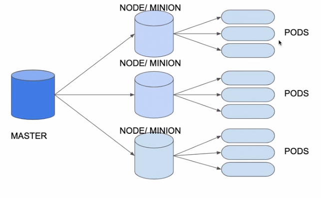

# Kubernetes

- **Kubernetes** (k8s) é um cluster que administra e orquestra containers.
- **Minikube** é um ambiente de teste do Kubernetes
- Para rodar Minikube serve o comando: minikube start
- **kubectl** é a ferramenta na linha de comando para gerenciar o cluster Kubernetes.
- Todos os arquivos de configuração ficam no servidor mestre do K8s.
- O **servidor mestre** gerencia um conjunto de **nós** (minions), dentro de cada nó podem ser criados um conjunto de **pods**.
- Kubernetes consiste de masters e nodes/minions.
### **Arquitetura**


## Pods
- Para definir um container no Kubernetes é preciso definir um Pod
- Um Pod é a menor unidade de deploy no Kubernetes
- Um Pod agrupa um ou mais containers que compartilham a mesma interface de rede e sistema de arquivos
- Um Pod é um objeto no Kubernetes descrito por um arquivo YML
- O YML do Pod define qual é a imagem, porta, versão, nome entre outras configurações

## Deployments
- Funciona como um controlador do Pod
- Define as quantidade das replicas
- Garante a disponibilidade do Pod
- Usuário não acessa o deployment nem o pod (ele utiliza um serviço de loadBalance para isto)

## Services
- Para ter acesso ao deployment fora do Kubernetes precisa de um Service
- Existem vários tipos de serviços, entre eles o **LoadBalancer**
- O **serviço** fica associado ao deployment ou Pods através do **Selector**
- Podem ser acessados pelo usuário (via IP)
- Serviço de Load Balance por padrão utiliza Round-Robin
- Possuem IP estável

## Comandos úteis:
------

**Listar algum recurso:**
```bash
# Listar Nodes (nós):
kubectl get nodes
# Listar Pods:
kubectl get pods
# Listar Deployments:
kubectl get deployments
# Listar Services:
kubectl get services
# Para obter mais infos, em qualquer um dos comandos utilize a flag '-o wide'
kubectl get pods -o wide
```

**Detalhar algum recurso:**
```bash
kubectl describe [pods | nodes | deployments | services]
# ou 
kubectl describe pod <nome-do-pod>
```

**Adicionar Arquivo no cluster:**
```bash
# -f para FILE
 kubectl create -f .\deployment-aplicacao.yml
```

**Deletar um pod:**
```bash
 kubectl delete pods <nome-do-pod>
```

**Obter Url de um Service:**
```bash
# para o minikube
minikube service <nome-do-service> --url
```