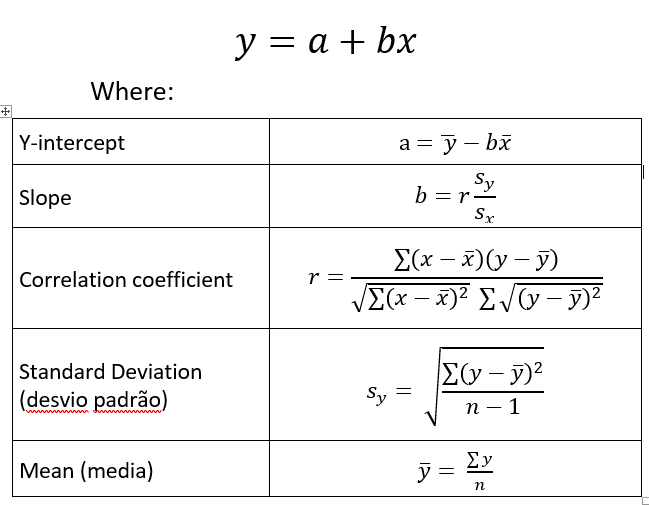

# Linear Regression

## Simple Linear Regression
- Encontra o relacionamento entre váriaveis, uma dependente e outras independentes.
  - **Variáveis dependentes** (responses) são as que você está tentando prever, e as **variáveis independentes** (predictors) são as observações(dados) que você utiliza para formar as conclusões.
  > The core idea is to obtain a line that best fits the data. The best fit line is the one for which total prediction error (all data points) are as small as possible. Error is the distance between the point to the regression line.
- **Simple Linear Regression function:**
  - 
    

### Vídeos:
- [How To... Perform Simple Linear Regression by Hand](https://www.youtube.com/watch?v=GhrxgbQnEEU)
- [How To... Calculate Pearson's Correlation Coefficient (r) by Hand](https://www.youtube.com/watch?v=2SCg8Kuh0tE)