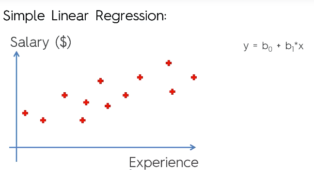

# Regressão Linear
- Encontra o relacionamento entre váriaveis, uma dependente e outras independentes.
  - **Variáveis dependentes** (responses ou target values) são as que você está tentando prever, e as **variáveis independentes** (predictors) são as observações(dados) que você utiliza para formar as conclusões.
  > The core idea is to obtain a line that best fits the data. The best fit line is the one for which total prediction error (all data points) are as small as possible. Error is the distance between the point to the regression line.
  > Linear regression is a linear model, e.g. a model that assumes a linear relationship between the input variables (x) and the single output variable (y). More specifically, that y can be calculated from a linear combination of the input variables (x).
- Sempre chega no final a um resultado número, baseado nas variáveis recebidas.
- Pode ser interpretada como uma lógica que descobre uma função em baseando-se em um conjunto de dados relacionados. A função é a relação entre as variáveis envolvidas.
- Utiliza conceitos da estatística como desvio padrão, médias, etc. para sua fórmula.
- Os dados precisam estar na mesma 'escala' para que o modelo atinja um resultado satisfatório, é necessario o uso de ***feature scaling*** para resolver a diferência de magnetudes dos dados.
- Exemplo:
- 

## Simple Linear Regression
  > When there is a single input variable (x), the method is referred to as simple linear regression. When there are multiple input variables, literature from statistics often refers to the method as multiple linear regression.
- **Simple Linear Regression function:**
- 

## Ordinary Least Square
- Distância dos pontos observados da linha do modelo em um plano cartesiano. 
- **O algorítmo desenhenha várias linhas no plano e mede a soma das distâncias dos pontos até a linha, até encontrar a menor. Quando encontrado o menor, o algorítmo sabe o melhor local para a linha, logo o modelo está projetado para receber e prever valores.**
- 
- Gráfico:
- 

## Python
- Usando sklearn, a biblioteca já cuida do feature scalling dos dados.
- Exemplo:
```python
from sklearn.linear_model import LinearRegression
from pandas import pd
from matplotlib import pyplot as plt

data = pd.read_csv('Salary_data.csv')
x = data.iloc[:, 0].values
y = data.iloc[:, 1].values

regressor = LinearRegression()
regressor.fit(x, y)

y_pred = regressor.predict(X_test)

plt.scatter(x,y,color='red')
plt.plot(x,regressor.predict(x), color='blue')
plt.show()

```
# Medindo a efetividade do Modelo Linear
Existem alguns cálculos que podem ser feitos que podem dar informações para a avaliação da efetividade do modelo de predição. Abaixo alguns deles:

## Absolute Error
- Um erro é a distância dos pontos previstos (linha de regressão) até os pontos reais.
- 
- Você pode tirar a média dos dados previstos para obter o **MAE (mean absolute error)**

## Mean Square Error (MSE)
- Definição: 
  - É a média dos erros ao quadrado em m modelo de regressão linear. **Um erro (erro residual) é a distância entre o ponto previsto e o ponto real em um plano cartesiano**.
  - É como se fosse uma "margem" de erro das previsões do seu modelo.
  - Também visto como SSEres (sum of square of residuais)
  - 
  > The mean squared error tells you how close a regression line is to a set of points. It does this by taking the distances from the points to the regression line (these distances are the “errors”) and squaring them. **The squaring is necessary to remove any negative signs**. It also gives more weight to larger differences. It’s called the mean squared error as you’re finding the average of a set of errors. 
- Passo a passo:
    1. Find the regression line.
    2. Insert your X values into the linear regression equation to find the new Y values (Y’).
    3. Subtract the new Y value from the original to get the error.
    4. Square the errors.
    5. Add up the errors.
    6. Find the mean.
- **Quanto menor for a MSE, melhor é o seu modelo de predição**

## Root Mean Square Error (RMSE)
- Definição:
  - Desvio padão dos erros
  - 
  - Basicamente é pegar a fórmula da MSE e aplicar raiz quadrada nela (?)
  > Root Mean Square Error (RMSE) is the standard deviation of the residuals (prediction errors). Residuals are a measure of how far from the regression line data points are; RMSE is a measure of how spread out these residuals are. In other words, it tells you how concentrated the data is around the line of best fit. Root mean square error is commonly used in climatology, forecasting, and regression analysis to verify experimental results
- Passo a passo:
  1. Squaring the residuals.
  1. Finding the average of the residuals.
  1. Taking the square root of the result. 
> When standardized observations and forecasts are used as RMSE inputs, there is a direct relationship with the correlation coefficient. For example, if the correlation coefficient is 1, the RMSE will be 0, because all of the points lie on the regression line (and therefore there are no errors).

### Referências:
- [Linear Regression for Machine Learning](https://machinelearningmastery.com/linear-regression-for-machine-learning/)
- [Mean Squared Error Definition](https://www.statisticshowto.datasciencecentral.com/mean-squared-error/)
- [What is Root Mean Square Error (RMSE)?](https://www.statisticshowto.datasciencecentral.com/rmse/)
- [Absolute Error & Mean Absolute Error (MAE)](https://www.statisticshowto.datasciencecentral.com/absolute-error/)
  
### Vídeos:
- [How To... Perform Simple Linear Regression by Hand](https://www.youtube.com/watch?v=GhrxgbQnEEU)
- [How To... Calculate Pearson's Correlation Coefficient (r) by Hand](https://www.youtube.com/watch?v=2SCg8Kuh0tE)

### Dúvidas:
- MSE só serve para regressão simples? (1 dimensão?)
- Diferença entre o MAE e o MSE?
- O que o RMSE traz de informação para análise?