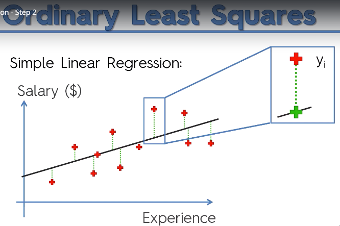

# Linear Regression
- Encontra o relacionamento entre váriaveis, uma dependente e outras independentes.
  - **Variáveis dependentes** (responses ou target values) são as que você está tentando prever, e as **variáveis independentes** (predictors) são as observações(dados) que você utiliza para formar as conclusões.
  > The core idea is to obtain a line that best fits the data. The best fit line is the one for which total prediction error (all data points) are as small as possible. Error is the distance between the point to the regression line.
  > Linear regression is a linear model, e.g. a model that assumes a linear relationship between the input variables (x) and the single output variable (y). More specifically, that y can be calculated from a linear combination of the input variables (x).
- Sempre chega no final a um resultado número, baseado nas variáveis recebidas.
- Pode ser interpretada como uma lógica que descobre uma função em baseando-se em um conjunto de dados relacionados. A função é a relação entre as variáveis envolvidas.
- Utiliza conceitos da estatística como desvio padrão, médias, etc. para sua fórmula.
- Os dados precisam estar na mesma 'escala' para que o modelo atinja um resultado satisfatório, é necessario o uso de ***feature scaling*** para resolver a diferência de magnetudes dos dados.
- Exemplo:
- 

## Simple Linear Regression
  > When there is a single input variable (x), the method is referred to as simple linear regression. When there are multiple input variables, literature from statistics often refers to the method as multiple linear regression.
- **Simple Linear Regression function:**
- 

## Ordinary Least Square
- Distância dos pontos observados da linha do modelo em um plano cartesiano. 
- **O algorítmo desenhenha várias linhas no plano e mede a soma das distâncias dos pontos até a linha, até encontrar a menor. Quando encontrado o menor, o algorítmo sabe o melhor local para a linha, logo o modelo está projetado para receber e prever valores.**
- 
- Gráfico:
- 

## Python
- Usando sklearn, a biblioteca já cuida do feature scalling dos dados.
- Exemplo:
```python
from sklearn.linear_model import LinearRegression
regressor = LinearRegression()
regressor.fit(x, y)

y_pred = regressor.predict(X_test)
```
    
### Referências:
- [Linear Regression for Machine Learning](https://machinelearningmastery.com/linear-regression-for-machine-learning/)
  
### Vídeos:
- [How To... Perform Simple Linear Regression by Hand](https://www.youtube.com/watch?v=GhrxgbQnEEU)
- [How To... Calculate Pearson's Correlation Coefficient (r) by Hand](https://www.youtube.com/watch?v=2SCg8Kuh0tE)