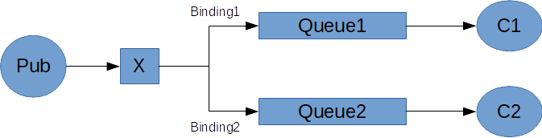

# Rabbit MQ

## Defaults
- **Port**: 5672
- **Manager Port**: 15672
- **Docker image**: docker run -it --rm --name rabbitmq -p 5672:5672 -p 15672:15672 rabbitmq:3-management

## Scheme


## Terms
1. > **Producing** means nothing more than sending. A program that sends messages is a **producer**.
1. > A **queue** is the name for a post box which lives inside RabbitMQ. Although messages flow through RabbitMQ and your applications, they can only be stored inside a queue. A queue is only bound by the host's memory & disk limits, it's essentially a large message buffer. Many producers can send messages that go to one queue, and many consumers can try to receive data from one queue.
1. > **Consuming** has a similar meaning to receiving. A **consumer** is a program that mostly waits to receive messages.
1. > An **ack(nowledgement)** is sent back by the consumer to tell RabbitMQ that a particular message has been received, processed and that RabbitMQ is free to delete it.
1. > An **exchange** is a very simple thing. On one side it receives messages from producers and the other side it pushes them to queues. The exchange must know exactly what to do with a message it receives. Should it be appended to a particular queue? Should it be appended to many queues? Or should it get discarded. The rules for that are defined by the exchange type.
    
    **Exchange Types:**
    1. > **Fanout**: The fanout exchange is very simple. As you can probably guess from the name, it just broadcasts all the messages it receives to all the queues it knows.
1. Bacon

    
## !Important!
1. > The core idea in the messaging model in RabbitMQ is that the producer never sends any messages directly to a queue. Actually, quite often the producer doesn't even know if a message will be delivered to any queue at all.
1. > There are a few exchange types available: **direct**, **topic**, **headers** and **fanout**.
1. Pattern **Push/Subscribe** -> One message to multiple consumers.

## CLI Commands
Listing exchanges:
```
rabbitmqctl list_exchanges
```

## References:
- [DotNet Tutorial](https://www.rabbitmq.com/tutorials/tutorial-one-dotnet.html)
- [Playlist Rabbit MQ](https://www.youtube.com/watch?v=QzBvkZ4L1dg&list=PLfhPyyHRfeug87iBjkAP2ulwcqObiO_fW)
- [Gago.io RabbitMQ e AMQP](https://gago.io/blog/rabbitmq-amqp-1-prefacio/)