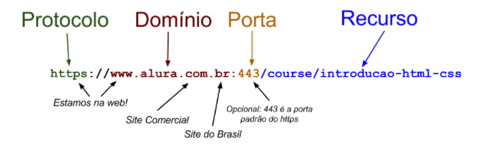

# HTTP
- Hypertext Transfer Protocol
- Definido no [rfc2616](https://datatracker.ietf.org/doc/html/rfc2616)
- o modelo http não guarda estado, cada requisicao é unica

# HTTPS
- HTTP transporta dados com texto puro, tornando o dado visivel a intermediarios como o provedor ou o roteador de algum local publico. Isso faz com que seja inseguro para transito de informações sigilosas, daí a necessidade da criação de uma camada de segurança, o HTTPS.
- HTTP + SSL/TLS (Secure Sockets Layer/Transport Layer Security)
- A identidade do servidor é realizada através de um certificado digital. 
- O navegador recebe uma chave pública para criptografar os dados e os envia criptografados para o servidor, que tem a chave privada e consegue descriptografar a informação e visualizar os dados.
- todo certificado tem uma data de validade.
- O browser confia em autoridades certificadoras, que emitem os certificados para os sites.
- O certificado guarda a chave pública.
- a porta padrão para https é 443 e para http é 80 (servidores web)

# DNS
- comando ```nslookup``` ve o endereço ip de um dominio
- Como é uma URL:

    

# URI ou URL?
- URL é um tipo de URI, que identifica o recurso através do endereço web, existem outros tipos de URI, como o URN que identifica o recurso de outra forma. No contexto da web URI e URL são utilizados como sinônimos.

# Requisição/Resposta
- um servidor pode guardar uma sessão, utilizando cookies HTTP.
- cookie é um pequeno arquivo de texto.
- cookies podem ser utilizados para guardar varios tipos de informação sobre o usuário.


