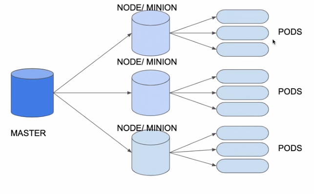

# Kubernetes

- **Kubernetes** (k8s) é um cluster que administra e orquestra containers.
- **Minikube** é um ambiente de teste do Kubernetes
- Para rodar Minikube serve o comando: minikube start
- **kubectl** é a ferramenta na linha de comando para gerenciar o cluster Kubernetes.
- Todos os arquivos de configuração ficam no servidor mestre do K8s.
- O **servidor mestre** gerencia um conjunto de **nós** (minions), dentro de cada nó podem ser criados um conjunto de **pods**.
- Kubernetes consiste de masters e nodes/minions.
### **Arquitetura**


## Pods
- Para definir um container no Kubernetes é preciso definir um Pod
- Um Pod é a menor unidade de deploy no Kubernetes
- Um Pod agrupa um ou mais containers que compartilham a mesma interface de rede e sistema de arquivos
- Um Pod é um objeto no Kubernetes descrito por um arquivo YML
- O YML do Pod define qual é a imagem, porta, versão, nome entre outras configurações
- Um pod só é declarado com o encerrado caso **TODOS** os containers contidos nele sejam encerrados

### Comunicação entre Pods
Por padrão, cada vez que um pod é criado é atribuído um novo IP para ele dentro do cluster. Pods são efêmeros.
É possível atribuir IPs fixos para comunicação entre os pods ou criar um DNS para o pod utilizando um **service**. Services também podem fazer balanceamento de carga.
alguns exemplos de Service que ajudam nessas tarefas:
 - ClusterIP
 - NodePort
 - LoadBalancer

## Deployments
- Funciona como um controlador do Pod
- Define as quantidade das replicas
- Garante a disponibilidade do Pod
- Usuário não acessa o deployment nem o pod (ele utiliza um serviço de loadBalance para isto)

## Services
- Para ter acesso ao deployment fora do Kubernetes precisa de um Service
- Existem vários tipos de serviços, entre eles o **LoadBalancer**
- O **serviço** fica associado ao deployment ou Pods através do **Selector**
- Podem ser acessados pelo usuário (via IP)
- Possuem IP estável (fixo)

### ClusterIP
 É possivel definir um ip fixo para um pod que contiver uma label especifica configurada.
 também é possivel atribuir uma porta externa que mapeia para uma porta diferente dentro do pod.

 ### NodePort
 Permite acesso externo a ips internos dentro do Cluster. NodePorts também funcionam como ClusterIPs.
 As portas de acesso externo são acima de 30000 até 32767. Os Nodeports são compartilhados entre os nós do cluster.

 ### Load Balancer
 é um ClusterIP que permite uma maquina do mundo externo e os nossos pods, mas que se integra automaticamente aos load balancers de cloud providers. 

 ### Config Maps
 Dicionarios de chave valor que podem ser referenciados e compartilhados por diferentes pods.

 ### Replica Sets
 Estrutura que pode encapsular 1 ou mais pods. O Replica set pode criar novos pods caso um pod do set falhe. Por exemplo: se eu desejo 3 pods em um replica set e 1 falha, o set irá criar um novo no lugar deste.

 ### Deployment
 Camada acima do replicaset. Quando vc cria um deployment, vc cria um replicaset.
 Permite controle de versão dos replicasets.

 ### Volume
 Volumes possuem ciclos de vida independentes dos containers. Porém são dependentes dos pods. O kubernetes suporta diversos tipos de volumes. um exemplo deles é o hostPath, que linka com uma pasta a um diretório do host.

 ### Persistent Volume
 Volumes configurados em cloud providers como o GKE por exemplo. O pod precisa de um PersistentVolumeClaim para acessar esse PersistentVolume.

 ### Storage Classes
Gerencia os discos em um cloud provider, cria e remove persistent volumes dinamicamente. Ao deletar a storage class do cluster, o disco é removido do cloud provider. Um cluster local de desenvolvimento possui um storage class padrão criado automaticamente com o cluster também.

### Stateful Sets
Funciona de maneira similar ao deployment, mas é para aplicações que possuem persistência. Utiliza o storage class padrão que o cluster sempre possui para atrelar os PVCs (persistentVolumeClaims) atrelados ao stateful set a um PV (persistent Volume).

### Liveness Probe
"Prova de vida" de uma aplicação dentro de um pod. É como o kubernetes sabe se precisa ou não reiniciar aquele pod. Normalmente aponta para um HealthCheck em uma aplicação para se saber se ela está OK.

## Comandos úteis:
------

**Listar algum recurso:**
```bash
# Listar Nodes (nós):
kubectl get nodes
# Listar Pods:
kubectl get pods
# Listar Deployments:
kubectl get deployments
# Listar Services:
kubectl get services
# Para obter mais infos, em qualquer um dos comandos utilize a flag '-o wide'
kubectl get pods -o wide
# Listar configmaps
kubectl get configmap
```

**Detalhar algum recurso:**
```bash
kubectl describe [pods | nodes | deployments | services]
# ou 
kubectl describe pod <nome-do-pod>
```

**Adicionar Arquivo no cluster: (OLD)**
```bash
# -f para FILE
 kubectl create -f .\deployment-aplicacao.yml
```

**Declarar um recurso através de um arquivo (pods, services, etc):**
```bash
kubectl apply -f ./Exemplos/kubernetes-alura/primeiro-pod.yaml
```

**Remover um pod declarado via arquivo:**
```bash
kubectl delete -f ./Exemplos/kubernetes-alura/primeiro-pod.yaml
```

**executar terminal bash dentro de uma pod:**
(pode ser que precise usar /bin/sh dependendo da imagem. Não esquecer do '--')
```bash
kubectl exec -it <nome-do-pod> -- bash
```

**Deletar um recurso:**
Pode deletar pods, svcs, configmaps, etc
Pode ser utilizado com a flag --all para deletar tudo de uma vez.
```bash
 kubectl delete <recurso> <nome-do-pod>
```

**Obter Url de um Service: (OLD)**
```bash
# para o minikube
minikube service <nome-do-service> --url
```
----
### Deployments
**Puxar o histórico de um deployment**
```bash
 kubectl rollout history deployment <nome-deployment>
```

**aplicando uma nova versão de um deployment**
```bash
 kubectl apply -f <nome-arquivo-deployment> --record
```

**trocando a mensagem de atualização de uma linha de histórico de deployment**
```bash
 kubectl annotate deployment <nome-deployment> kubernetes.io/change-cause="texto" 
```

**voltando o deployment a uma versão anterior**
```bash
 kubectl rollout undo deployment <nome-deployment> --to-revision=<numero>
```